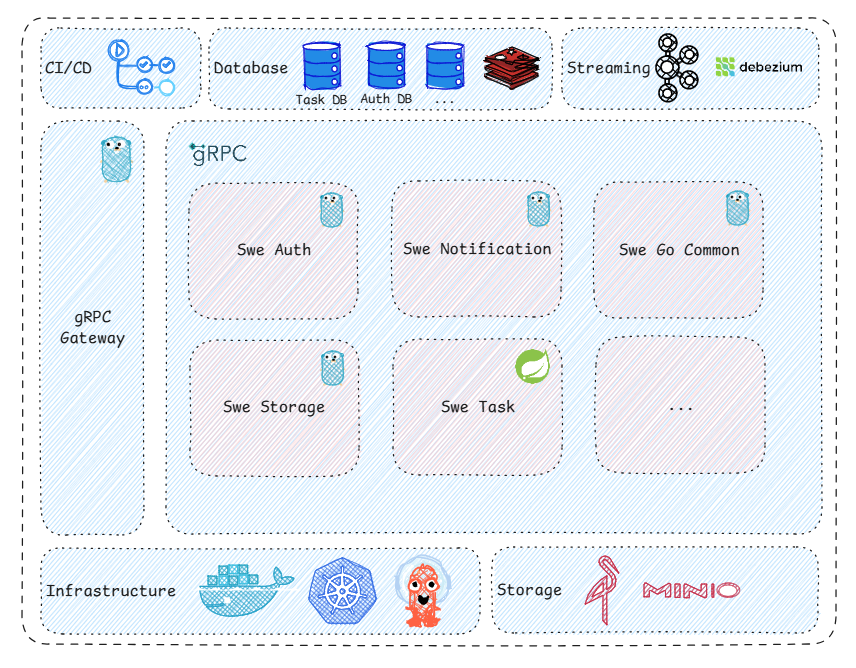

# SWE-MICROSERVICE

This microservice is developed using gRPC with Go and Java. The gateway is built utilizing gRPC Gateway, and the
database employed is PostgreSQL.

Services communicate with each other via gRPC and Kafka. File storage is managed using MinIO.

Debezium is used to capture changes in the database and publish them to Kafka. The data is then consumed by the services
to update their internal data.

For continuous integration and continuous deployment (CI/CD), GitHub Actions are used to build and push Docker images to
the Docker registry. The deployment process is handled with Kubernetes and ArgoCD for streamlined continuous deployment.

## Tech stack

- [x] [Go](https://golang.org/)
- [x] [Java](https://www.java.com/en/)
- [x] [gRPC Gateway](https://grpc-ecosystem.github.io/grpc-gateway/)
- [x] [Protocol Buffers](https://developers.google.com/protocol-buffers)
- [x] [PostgreSQL](https://www.postgresql.org/)
- [x] [Kafka](https://kafka.apache.org/)
- [x] [Debezium](https://debezium.io/)
- [x] [MinIO](https://min.io/)
- [x] [Docker](https://www.docker.com/)
- [x] [Kubernetes](https://kubernetes.io/)
- [x] [ArgoCD](https://argoproj.github.io/argo-cd/)
- [x] [GitHub Actions](https://docs.github.com/en/actions)

## Architecture

## Common shared libraries

- [x] [swe-go-common-shared](https://github.com/ngdangkietswe/swe-go-common-shared)
- [x] [swe-java-common-shared](https://github.com/ngdangkietswe/swe-java-common-shared)

## Protobuf shared

- [x] [swe-protobuf-shared](https://github.com/ngdangkietswe/swe-protobuf-shared)

## Migration database

- [x] [swe-migration](https://github.com/ngdangkietswe/swe-migration)

## Services

- [x] [swe-task-service](https://github.com/ngdangkietswe/swe-task-service)
- [x] [swe-time-tracking-service](https://github.com/ngdangkietswe/swe-time-tracking-service)
- [x] [swe-auth-service](https://github.com/ngdangkietswe/swe-auth-service)
- [x] [swe-storage-service](https://github.com/ngdangkietswe/swe-storage-service)
- [x] [swe-notification-service](https://github.com/ngdangkietswe/swe-notification-service)
- [x] [swe-integration-service](https://github.com/ngdangkietswe/swe-integration-service)

## Gateway

- [x] [swe-grpc-gateway](https://github.com/ngdangkietswe/swe-grpc-gateway)

## Infrastructure

- [x] [swe-debezium](https://github.com/ngdangkietswe/swe-debezium)
- [x] [swe-infrastructure](https://github.com/ngdangkietswe/swe-infrastructure)
- [x] [swe-argocd](https://github.com/ngdangkietswe/swe-argocd)
